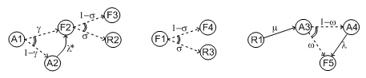

Stochastic Layer
================

Description
-----------

The stochastic layer is populated with failure probabilities or failure
probability distributions associated with basic events (in the event
tree linking approach, functional events also can be associated with
such a distribution). Probability distributions are described by
(stochastic) expressions, which are terms, according to the terminology
of Chapter `III <#anchor-13>`__. These expressions may depend on
parameters (variables), so the stochastic layer can be seen a set of
stochastic equations.

Stochastic equations associated with basic events play actually two
roles:

- They are used to calculate probability distributions of each basic
  event, i.e., for a given mission time t, the probability Q(t) that the
  given basic event occurs before t. The probability distribution
  associated with a basic event is typically a negative exponential
  distribution of parameter *λ*:

Note that, for the sake of the clarity, the Model Exchange Format
represents explicitly the mission time as a parameter of a special type.

- Parameters are sometimes not known with certainty. Sensitivity
  analyses, such as Monte-Carlo simulations, are thus performed to
  study the change in risk due to this uncertainty. Expressions are
  therefore used to describe distributions of parameters. Typically,
  the parameter *λ* of a negative exponential distribution will be itself
  distributed according to a lognormal law of mean 0.001 and error
  factor 3.

Stochastic expressions are made of the following elements:

- Boolean and numerical constants
- Stochastic variables, i.e., parameters,
  including the special variable to represent the mission time
- Boolean and arithmetic operations (sums, differences, products...)
- Built-in expressions that can be seen as macro-expressions that are
  used to simplify and shorten the writing of probability distributions
  (e.g., exponential, Weibull...)
- Primitives to generate numbers at pseudo-random according to some
  probability distribution. The base primitive makes it possible to
  generate random deviates with a uniform probability distribution.
  Several other primitives are derived from this one to generate random
  deviates with normal, lognormal, or other distributions.
  Moreover, it is possible to define discrete distributions "by hand"
  through the notion of histogram.
- Directives to test the status of initial and functional events

:numref:`bnf_stochastic_layer` sketches the Backus-Naur
form for the constructs of the stochastic layer. Note that, conversely
to variables (events) of the Fault Tree layer, parameters have to be
defined (there is no equivalent to Basic Events).

.. code-block:: bnf
    :name: bnf_stochastic_layer
    :caption: Backus-Naur form for the constructs of the stochastic layer (sketch)

    basic-event-declaration ::= basic-event = expression
    parameter-declaration ::= parameter = expression
    expression ::=
        constant | parameter | operation | built-in | random-deviate | test-event
    constant ::= bool | integer | float
    parameter ::= regular-parameter | system-mission-time
    operation ::=
         and expression+
        | or expression+
        | not expression
        | eq expression expression
        | df expression expression
        ...
        | neg expression
        | add expression+
        | sub expression+
        | mul expression+
        | div expression+
        | pow expression expression
        ...
        | if expression then expression else expression

    built-in ::=
          exponential expression expression
        | Weibull expression expression expression expression
        ...

    random-deviate ::=
          uniform-deviate expression expression
        | lognormal-deviate expression expression expression
        | histogram
        ...

    test-event ::=
          test-initial-event name
        | test-functional-event name state

The XML representation of the stochastic layer just reflects these
different constructs.

.. code-block:: bnf
    :caption: Backus-Naur grammar for XML representation of expressions (main)

    parameter-definition ::=
        <define-parameter name="identifier"
            [ role="private|public" ] [ unit="unit" ]>
            [ label ] [ attributes ]
            expression
        </define-parameter>

    unit ::= bool | int | float | hours | hours-1 | years | years-1| demands | fit

    expression ::=
        constant | parameter | operation | built-in | random-deviate | test-event

    constant ::=
          <bool value="Boolean-value" />
        | <int value="integer" />
        | <float value="float" />

    parameter ::=
          <parameter name="identifier" [ unit="unit" ] />
        | <system-mission-time [ unit="unit" ] />

    operation ::=
        numerical-operation | Boolean-operation | conditional-operation

Operations, built-ins and random deviates will be described in the
following sections.

We believe that the formalism to define stochastic equations should be
as large and as open as possible for at least two reasons: first,
available tools already propose a large set of distributions; second
this is a easy and interesting way to widen the spectrum of PSA. The
Model Exchange Format proposes a panoply of Boolean and arithmetic
operators. More operations can be added on demand. A major step would be
to introduce some algorithmic concepts like loops and functions. At this
stage, it does seem useful to introduce such advanced concepts in the
Model Exchange Format.

Operations
----------

Numerical Operation
~~~~~~~~~~~~~~~~~~~

:numref:`table_numerical_operations` gives the list of arithmetic
operators proposed by the Model Exchange Format. Their XML
representation is given :numref:`bnf_numerical_operations`.

.. table:: Numerical Operations, their number of arguments and their semantics
    :name: table_numerical_operations

    +-----------+------------+-----------------------------------------+
    | Operator  | #arguments | Semantics                               |
    +===========+============+=========================================+
    | **neg**   | 1          | unary minus                             |
    +-----------+------------+-----------------------------------------+
    | **add**   | >1         | addition                                |
    +-----------+------------+-----------------------------------------+
    | **sub**   | >1         | subtraction                             |
    +-----------+------------+-----------------------------------------+
    | **mul**   | >1         | multiplication                          |
    +-----------+------------+-----------------------------------------+
    | **div**   | >1         | division                                |
    +-----------+------------+-----------------------------------------+
    | **pi**    | 0          | 3.1415926535...                         |
    +-----------+------------+-----------------------------------------+
    | **abs**   | 1          | absolute value                          |
    +-----------+------------+-----------------------------------------+
    | **acos**  | 1          | arc cosine of the argument in radians   |
    +-----------+------------+-----------------------------------------+
    | **asin**  | 1          | arc sine of the argument in radians     |
    +-----------+------------+-----------------------------------------+
    | **atan**  | 1          | arc tangent of the argument in radians  |
    +-----------+------------+-----------------------------------------+
    | **cos**   | 1          | cosine                                  |
    +-----------+------------+-----------------------------------------+
    | **cosh**  | 1          | hyperbolic cosine                       |
    +-----------+------------+-----------------------------------------+
    | **exp**   | 1          | exponential                             |
    +-----------+------------+-----------------------------------------+
    | **log**   | 1          | (Napierian) logarithm                   |
    +-----------+------------+-----------------------------------------+
    | **log10** | 1          | decimal logarithm                       |
    +-----------+------------+-----------------------------------------+
    | **mod**   | 2          | modulo                                  |
    +-----------+------------+-----------------------------------------+
    | **pow**   | 1          | power                                   |
    +-----------+------------+-----------------------------------------+
    | **sin**   | 1          | sine                                    |
    +-----------+------------+-----------------------------------------+
    | **sinh**  | 1          | hyperbolic sine                         |
    +-----------+------------+-----------------------------------------+
    | **tan**   | 1          | tangent                                 |
    +-----------+------------+-----------------------------------------+
    | **tanh**  | 1          | hyperbolic tangent                      |
    +-----------+------------+-----------------------------------------+
    | **sqrt**  | 1          | square root                             |
    +-----------+------------+-----------------------------------------+
    | **ceil**  | 1          | first integer greater than the argument |
    +-----------+------------+-----------------------------------------+
    | **floor** | 1          | first integer smaller than the argument |
    +-----------+------------+-----------------------------------------+
    | **min**   | >1         | minimum                                 |
    +-----------+------------+-----------------------------------------+
    | **max**   | >1         | maximum                                 |
    +-----------+------------+-----------------------------------------+
    | **mean**  | >1         | mean                                    |
    +-----------+------------+-----------------------------------------+

.. code-block:: bnf
    :name: bnf_numerical_operations
    :caption: Backus-Naur grammar for XML representation of numerical operations

    numerical-operation ::=
          <neg> expression </neg>
        | <add> expression+ </add>
        |  expression+ 
        | <mul> expression+ </mul>
        | 
 expression+ 

        | <pi />
        | <abs> expression </abs>
        | <acos> expression </acos>
        | <asin> expression </asin>
        | <atan> expression </atan>
        | <cos> expression </cos>
        | <cosh> expression </cosh>
        | <exp> expression </exp>
        | <log> expression </log>
        | <log10> expression </log10>
        | <mod> expression expression </mod>
        | <pow> expression expression </pow>
        | <sin> expression </sin>
        | <sinh> expression </sinh>
        | <tan> expression </tan>
        | <tanh> expression </tanh>
        | <sqrt> expression </sqrt>
        | <ceil> expression </ceil>
        | <floor> expression </floor>
        | <min> expression+ </min>
        | <max> expression+ </max>
        | <mean> expression+ </mean>

Example
^^^^^^^

Assume for instance we want to associate a negative
exponential distribution with a failure rate *λ*\ =1.23e-4/h to the basic
event "pump-failure". Using primitives defined above, we can encode
explicitly such probability distribution as follows.

.. code-block:: xml

    <define-basic-event name="pump-failure">
        
            <float value="1.0"/>
            <exp>
                <mul>
                    <neg>
                        <parameter name="lambda"/>
                    </neg>
                    <system-mission-time/>
                </mul>
            </exp>
        
    </define-basic-event>
    <define-parameter name="lambda">
        <float value="1.23e-4"/>
    </define-parameter>

Boolean Operations
~~~~~~~~~~~~~~~~~~

:numref:`table_boolean_operators` gives the list of Boolean
operators proposed by the Model Exchange Format. Their XML
representation is given :numref:`bnf_boolean_operations`.

.. table:: Boolean operators, their number of arguments and their semantics
    :name: table_boolean_operators

    +----------+------------+-------------+
    | Operator | #arguments | Semantics   |
    +==========+============+=============+
    | **and**  | > 1        | Boolean and |
    +----------+------------+-------------+
    | **or**   | >1         | Boolean or  |
    +----------+------------+-------------+
    | **not**  | 1          | Boolean not |
    +----------+------------+-------------+
    | **eq**   | 2          | =           |
    +----------+------------+-------------+
    | **df**   | 2          |  ≠          |
    +----------+------------+-------------+
    | **lt**   | 2          | <           |
    +----------+------------+-------------+
    | **gt**   | 2          | >           |
    +----------+------------+-------------+
    | **leq**  | 2          |  ≤          |
    +----------+------------+-------------+
    | **geq**  | 2          |  ≥          |
    +----------+------------+-------------+

.. code-block:: bnf
    :name: bnf_boolean_operations
    :caption: Backus-Naur grammar for XML representation of Boolean operations

    Boolean-operation ::=
          <not> expression </not>
        | <and> expression+ </and>
        | <or> expression+ </or>
        | <eq> expression expression </eq>
        | <df> expression expression </df>
        | <lt> expression expression </lt>
        | <gt> expression expression </gt>
        | <leq> expression expression </leq>
        | <geq> expression expression </geq>

Conditional Operations
~~~~~~~~~~~~~~~~~~~~~~

The Model Exchange Format proposes two conditional operations: an
"if-then-else" operation and a "switch/case" operation. The latter is a
list of pairs of expressions, introduced by the tag "case". The first
expression of the pair should be a Boolean condition. If this condition
is realized, then the second expression is evaluated and its value
returned. Otherwise, the next pair is considered.

The list ends with an expression, in order to be sure that the switch
has always a possible value. The XML representation for conditional
operation is given :numref:`bnf_conditional_operations`.

.. code-block:: bnf
    :name: bnf_conditional_operations
    :caption: Backus-Naur grammar for XML representation of conditional operations

    conditional-operation ::=
        if-then-else-operation | switch-operation

    if-then-else-operation ::=
        <ite> expression expression expression </ite>

    switch-operation ::=
        <switch>
            case-operation*
            expression
        </switch>

    case-operation ::= <case> expression expression </case>

Example
^^^^^^^
Assume for instance we want to give different values to the
failure rate "lambda" depending on a global parameter "stress-level":

::

    "lambda"=1.0e-4/h if "stress-level"=1,
    "lambda"=2.5e-4/h if "stress-level"=2, and finally
    "lambda"=1.0e-3/h if "stress-level"=3.

The value of "stress-level" will be modified while walking along the
sequences of events trees or depending on the initiating event. Using
primitives defined so far, we can encode the definition of "lambda" as
follows.

.. code-block:: xml

    <define-parameter name="lambda">
        <switch>
            <case>
                <eq>
                    <parameter name="stress-level"/>
                    <int value="1"/>
                </eq>
                <float value="1.0e-4"/>
            </case>
            <case>
                <eq>
                    <parameter name="stress-level"/>
                    <int value="2"/>
                </eq>
                <float value="2.5e-4"/>
            </case>
            <float value="1.0e-3"/>
        </switch>
    </define-parameter>

Built-Ins
---------

Description
~~~~~~~~~~~

Built-ins can be seen as macro arithmetic expressions. They are mainly
used to simplify the writing of probability distributions. A special
built-in "extern-function" makes it possible to define externally
calculated built-ins. As for arithmetic operators, more built-ins can be
added on demand to the Model Exchange Format.
Here follows a preliminary list of built-ins.
:numref:`table_built_ins` summarizes this preliminary list.

Exponential with two parameters
    This built-in implements the negative exponential distribution.
    The two parameters are the hourly failure rate, usually called *λ*, and the time *t*.
    Its definition is as follows.

Exponential with four parameters (GLM)
    This built-in generalizes the previous one.
    It makes it possible to take into account repairable
    components (through the hourly repairing rate *µ*) and failures on
    demand (through the probability *γ* of such an event). It takes four
    parameters, *γ*, the hourly failure rate *λ*, *µ* and the time *t* (in
    this order). Its definition is as follows.

Weibull
    This built-in implements the Weibull distribution. It takes
    four parameters: a scale parameter *α*, a shape parameter *β*, a
    time shift *t*\ :sub:`0`, and the time *t* (in this order). Its definition
    is as follows.

Periodic test
    In several applications, it is of interest to introduce
    some specific distributions to describe periodically tested components.
    A further investigation is certainly necessary on this topic. We
    tentatively give here a candidate definition (that is extracted from one
    of the tools we considered).

The "periodic-test" built-in would take the following parameters (in order).

+---------------+---------------------------------------------------------------------------------------+
| **Parameter** | **Description**                                                                       |
+===============+=======================================================================================+
| **λ**         | failure rate when the component is working.                                           |
+---------------+---------------------------------------------------------------------------------------+
| **λ**\*       | failure rate when the component is tested.                                            |
+---------------+---------------------------------------------------------------------------------------+
| **µ**         | repair rate (once the test showed that the component is failed).                      |
+---------------+---------------------------------------------------------------------------------------+
| **τ**         | delay between two consecutive tests.                                                  |
+---------------+---------------------------------------------------------------------------------------+
| **θ**         | delay before the first test.                                                          |
+---------------+---------------------------------------------------------------------------------------+
| **γ**         | probability of failure due to the (beginning of the) test.                            |
+---------------+---------------------------------------------------------------------------------------+
| **π**         | duration of the test.                                                                 |
+---------------+---------------------------------------------------------------------------------------+
| **x**         | indicator of the component availability during the test (1 available, 0 unavailable). |
+---------------+---------------------------------------------------------------------------------------+
| **σ**         | test covering: probability that the test detects the failure, if any.                 |
+---------------+---------------------------------------------------------------------------------------+
| **ω**         | probability that the component is badly restarted after a test or a repair.           |
+---------------+---------------------------------------------------------------------------------------+
| **t**         | the mission time.                                                                     |
+---------------+---------------------------------------------------------------------------------------+

:numref:`fig_periodic_test` illustrates the meaning of the parameters *τ*, *θ* and *π*.

.. figure:: ../images/periodic_test.png
    :name: fig_periodic_test
    :align: center

    Meaning of parameters *τ*, *θ* and *π* of the "periodic-test" built-in

There are three phases in the behavior of the component. The first
phase corresponds to the time from 0 to the date of the first test, i.e. *θ*.
The second phase is the test phase.
It spreads from times *θ*\ +n.\ *τ* to *θ*\ +n.\ *τ*\ +\ *π*, with n any positive integer.
The third phase is the functioning phase.
It spreads from times *θ*\ +n.\ *τ*\ +\ *π* from *θ*\ +(n+1).\ *τ*.

In the first phase, the distribution is a simple exponential law of parameter *λ*.

The component may enter in the second phase in three states, either
working, failed or in repair. In the latter case, the test is not
performed. The Markov graphs for each of these cases are pictured
:numref:`fig_multi_phase_markov_graph`.

    Multi-phase Markov graph for the "periodic-test" built-in

Ai's, Fi's, Ri's states correspond respectively to states where the
component is available, failed and in repair. Dashed lines correspond to
immediate transitions. Initial states are respectively A1, F1 and R1.

The situation is simpler in the third phase. If the component enters
available this phase, the distribution follows an exponential law of
parameter *λ*. If the component enters failed in this phase, it remains
phase up to the next test. Finally, the Markov graph for the case where
the component is in repair is the same as in the second phase.

The Model Exchange Format could provide also two simplified forms for
the periodic test distribution.

Periodic-test with 5 arguments
    The first one takes five parameters: *λ*, *µ*, *τ*, *θ* and *t*.
    In that case, the test is assumed to be instantaneous.
    Therefore, parameters *λ*\* (the failure rate during the test) and x
    (indicator of the component availability during the test) are
    meaningless. There other parameters are set as follows.

    - *γ* (the probability of failure due to the beginning of the test) is set to 0.
    - *σ* (the probability that the test detects the failure, if any) is set to 1.
    - *ω* (the probability that the component is badly restarted after a test or a repair)
      is set to 0.

Periodic-test with 4 arguments
    The second one takes only four parameters: *λ*, *τ*, *θ* and t.
    The repair is assumed to be instantaneous (or equivalently the repair rate µ = +∞).

Extern functions
    The Model Exchange Format should provide a mean to
    call extern functions. This makes it extensible and allows the link the
    PSA assessment tools with complex tools to calculate physical behavior
    (like fire propagation or gas dispersion). This call may take any number
    of arguments and return a single value at once (some interfacing glue
    can be used to handle the case where several values have to be
    returned). It has been also suggested that extern function calls take
    XML terms as input and output. This is probably the best way to handle
    communication between tools, but it would be far too complex too embed
    XML into stochastic expressions.

.. table:: Built-ins, their number of arguments and their semantics
    :name: table_built_ins

    +---------------------+------------+---------------------------------------------------------------------------------------------------------------------------+
    | Built-in            | #arguments | Semantics                                                                                                                 |
    +=====================+============+===========================================================================================================================+
    | **exponential**     | 2          | negative exponential distribution with hourly failure rate and time                                                       |
    +---------------------+------------+---------------------------------------------------------------------------------------------------------------------------+
    | **exponential**     | 4          | negative exponential distribution with probability of failure on demand, hourly failure rate, hourly repair rate and time |
    +---------------------+------------+---------------------------------------------------------------------------------------------------------------------------+
    | **Weibull**         | 4          | Weibull distribution with scale and shape parameters, a time shift and the time                                           |
    +---------------------+------------+---------------------------------------------------------------------------------------------------------------------------+
    | **periodic-test**   | 11, 5 or 4 | Distributions to describe periodically tested components                                                                  |
    +---------------------+------------+---------------------------------------------------------------------------------------------------------------------------+
    | **extern-function** | any        | call to an extern routine                                                                                                 |
    +---------------------+------------+---------------------------------------------------------------------------------------------------------------------------+

XML Representation
~~~~~~~~~~~~~~~~~~

The Backus-Naur grammar for the XML representation of built-ins is given
:numref:`bnf_built_ins`.

.. code-block:: bnf
    :name: bnf_built_ins
    :caption: Backus-Naur grammar for XML representation of Built-ins

    built-in ::=
          <exponential> [ expression ]:2 </exponential>
        | <GLM> [ expression ]:4 </GLM>
        | <Weibull> [ expression ]:3 </Weibull>
        | <periodic-test> [ expression ]:11 </periodic-test>
        | <periodic-test> [ expression ]:5 </periodic-test>
        | <periodic-test> [ expression ]:4 </periodic-test>
        | <extern-function name="name" > expression* </extern-function>

.. admonition:: Positional versus Named Arguments

    We adopted a positional definition of arguments.
    For instance, in the negative exponential distribution,
    we assumed that the failure rate is always the first argument
    and the mission time is always the second.
    An alternative way would be to name arguments,
    i.e., to enclose them into tags explicating their role.
    For instance, the failure rate would be enclosed in a tag "failure-rate",
    the mission time in a tag "time" and so on...
    The problem with this second approach is that many additional tags must be defined,
    and it is not sure that it helps a lot the understanding of the built-ins.
    Nevertheless, we may switch to this approach
    if the experience shows that the first one proves to be confusing.

Example
^^^^^^^

The negative exponential distribution can be encoded in a simple way as follows.

.. code-block:: xml

    <define-basic-event name="pump-failure">
        <exponential>
            <parameter name="lambda"/>
            <system-mission-time/>
        </exponential>
    </define-basic-event>

Primitive to Generate Random Deviates
-------------------------------------

Description
~~~~~~~~~~~

Primitives to generate random deviates are the real stochastic part of
stochastic equations. They can be used in two ways: in a regular context
they return a default value (typically their mean value). When used to
perform Monte-Carlo simulations, they return a number drawn at
pseudo-random according their type. The Model Exchange Format includes
two types of random deviates: built-in deviates like uniform, normal or
lognormal, and histograms that are user defined discrete distributions. A
preliminary list of distributions is summarized in :numref:`table_random_deviates`.
As for arithmetic operators and built-ins, this
list can be extended on demand.

.. table:: Primitive to generate random deviates, their number of arguments and their semantics
    :name: table_random_deviates

    +-----------------------+------------+------------------------------------------------------------------------------------------------------------+
    | Distribution          | #arguments | Semantics                                                                                                  |
    +=======================+============+============================================================================================================+
    | **uniform-deviate**   | 2          | uniform distribution between a lower and an upper bounds                                                   |
    +-----------------------+------------+------------------------------------------------------------------------------------------------------------+
    | **normal-deviate**    | 2          | normal (Gaussian) distribution defined by its mean and its standard deviation                              |
    +-----------------------+------------+------------------------------------------------------------------------------------------------------------+
    | **lognormal-deviate** | 3          | lognormal distribution defined by its mean, its error factor and the confidence level of this error factor |
    +-----------------------+------------+------------------------------------------------------------------------------------------------------------+
    | **gamma-deviate**     | 2          | gamma distributions defined by a shape and a scale factors                                                 |
    +-----------------------+------------+------------------------------------------------------------------------------------------------------------+
    | **beta-deviate**      | 2          | beta distributions defined by two shape parameters *α* and *β*                                             |
    +-----------------------+------------+------------------------------------------------------------------------------------------------------------+
    | **histograms**        | any        | discrete distributions defined by means of a list of pairs                                                 |
    +-----------------------+------------+------------------------------------------------------------------------------------------------------------+

Uniform Deviates
    These primitives describe uniform distributions in a
    given range defined by its lower- and upper-bounds. The default value of
    a uniform deviate is the mean of the range, i.e., (lower-bound + upper-bound)/2.

Normal Deviates
    These primitives describe normal distributions
    defined by their mean and their standard deviation (refer to text book
    for a more detailed explanation). By default, the value of a normal
    distribution is its mean.

Lognormal distribution
    These primitives describe lognormal
    distributions defined by their mean µ and their error factor EF. A
    random variable is distributed according to a lognormal distribution if
    its logarithm is distributed according to a normal distribution. If µ
    and *σ* are respectively the mean and the standard deviation of the
    distribution, the probability density of the random variable is as follows.

    Its mean, *E(x)* is defined as follows.

    The confidence intervals [X\ :sub:`0,05`, X\ :sub:`0,95`] associated
    with a confidence level of *0.95* and the median X\ :sub:`0,50` are the following:

    The error factor *EF* is defined as follows:

    with and .

    Once the mean and the error factor are known, it is then possible to
    determine the confidence interval and thereby the parameters of the
    lognormal law.

Gamma Deviates
    These primitives describe Gamma distributions defined
    by their shape parameter k and their scale parameter *θ*. If k is an
    integer then the distribution represents the sum of k exponentially
    distributed random variables, each of which has mean *θ*.

    The probability density of the gamma distribution can be expressed in
    terms of the gamma function:

    The default value of the gamma distribution is its mean, i.e., k.\ *θ*.

Beta Deviates
    These primitives describe Beta distributions defined by
    two shape parameters *α* and *β*.

    The probability density of the beta distribution can be expressed in
    terms of the B function:

    The default value of the gamma distribution is its mean, i.e., *α*/(*α*\ +\ *β*).

Histograms
    Histograms are lists of pairs (x\ :sub:`1`, E\ :sub:`1`)...
    (x\ :sub:`n`, E\ :sub:`n`) where the x\ :sub:`i`'s are numbers such that
    x\ :sub:`i` < x\ :sub:`i+1` for i=1...n-1 and the E\ :sub:`i`'s are
    expressions.

    The x\ :sub:`i`'s represent upper bounds of successive intervals. The
    lower bound of the first interval x\ :sub:`0` is given apart.

    The drawing of a value according to a histogram is a two steps process.
    First, a value z is drawn uniformly in the range [x\ :sub:`0`,
    x\ :sub:`n`]. Then, a value is drawn at random by means of the
    expression E\ :sub:`i`, where i is the index of the interval such
    x\ :sub:`i-1` < z ≤ x\ :sub:`i`.

    By default, the value of a histogram is its mean, i.e.,

    Both Cumulative Distribution Functions and Density Probability
    Distributions can be translated into histograms.

    A Cumulative Distribution Function is a list of pairs (p\ :sub:`1`,
    v\ :sub:`1`)... (p\ :sub:`n`, v\ :sub:`n`), where the p\ :sub:`i`'s are such
    that p\ :sub:`i` < p\ :sub:`i+1` for i=1... n and p\ :sub:`n`\ =1. It
    differs from histograms in two ways. First, X axis values are normalized
    (to spread between 0 and 1) and second they are presented in a
    cumulative way. The histogram that corresponds to a Cumulative
    Distribution Function (p\ :sub:`1`, v\ :sub:`1`)... (p\ :sub:`n`, v\ :sub:`n`)
    is the list of pairs (x\ :sub:`1`, v\ :sub:`1`)... (x\ :sub:`n`, v\ :sub:`n`),
    with the initial value x\ :sub:`0` is 0, x\ :sub:`1` = p\ :sub:`1` and
    x\ :sub:`i` = p\ :sub:`i` - p\ :sub:`i-1` for all i>1.

    A Discrete Probability Distribution is a list of pairs (d\ :sub:`1`,
    m\ :sub:`1`)... (d\ :sub:`n`, m\ :sub:`n`). The d\ :sub:`i`'s are
    probability densities. They could be however any kind of values. The
    m\ :sub:`i`'s are midpoints of intervals and are such that m\ :sub:`1` <
    m\ :sub:`2` < ... < m\ :sub:`n` < 1. The histogram that corresponds to a
    Discrete Probability Distribution (d\ :sub:`1`, m\ :sub:`1`)... (d\ :sub:`n`,
    m\ :sub:`n`) is the list of pairs (x\ :sub:`1`, d\ :sub:`1`)... (x\ :sub:`n`,
    d\ :sub:`n`), with the initial value x\ :sub:`0` = 0, x\ :sub:`1` =
    2.m\ :sub:`1` and x\ :sub:`i` = x\ :sub:`i-1` + 2.(m\ :sub:`i`-x\ :sub:`i-1`).

XML Representation
~~~~~~~~~~~~~~~~~~

The Backus-Naur grammar for the XML representation of random deviates is given

.. code-block:: bnf
    :caption: Backus-Naur grammar for XML representation of random deviates

    random-deviate ::=
          <uniform-deviate> [ expression ]:2 </uniform-deviate>
        | <normal-deviate> [ expression ]:2 </normal-deviate>
        | <lognormal-deviate> [ expression ]:3 </lognormal-deviate>
        | <gamma-deviate> [ expression ]:2 </gamma-deviate>
        | <beta-deviate> [ expression ]:2 </beta-deviate>
        | histogram

    histogram ::= <histogram > expression /bin/+ </histogram>

    bin ::= <bin> expression expression </bin>

Example
^^^^^^^

Assume that the parameter "lambda" of a negative exponential
distribution is distributed according to a lognormal distribution of
mean 0.001 and error factor 3 for a confidence level of 95%. The
parameter "lambda" is then defined as follows.

.. code-block:: xml

    <define-parameter name="lambda">
        <lognormal-deviate>
            <float value="0.001"/>
            <float value="3"/>
            <float value="0.95"/>
        </lognormal-deviate>
    </define-parameter>

Example
^^^^^^^

Assume that the parameter "lambda" has been sampled outside
of the model and is distributed according to the following histogram.

.. image:: ../images/lambda_histogram.svg
    :align: center

The XML encoding for "lambda" is as follows.

.. code-block:: xml

    <define-parameter name="lambda">
        <histogram>
            <float value="100"/>
            <bin> <float value="170"/> <float value="0.70e-4"/> </bin>
            <bin> <float value="200"/> <float value="1.10e-4"/> </bin>
            <bin> <float value="210"/> <float value="1.30e-4"/> </bin>
            <bin> <float value="230"/> <float value="1.00e-4"/> </bin>
            <bin> <float value="280"/> <float value="0.50e-4"/> </bin>
        </histogram>
    </define-parameter>

Directives to Test the Status of Initiating and Functional Events
-----------------------------------------------------------------

Description
~~~~~~~~~~~

The Model Exchange Format provides two special directives to test
whether a given initiating event occurred and whether a given functional
event is in a given state. The meaning of these directives will be
further explained Section `VII.3 <#anchor-103>`__.

:numref:`table_test_event` presents these directives and their arguments.

.. table:: Directives to test the status of initiating and functional events
    :name: table_test_event

    +---------------------------+------------+-----------------------------------------------------------------------------------------------------------------------------------+
    | Built-in                  | #arguments | Semantics                                                                                                                         |
    +===========================+============+===================================================================================================================================+
    | **test-initiating-event** | 1          | <test-initiating-event name="name" /> returns true if the initiating event of the given name occurred.                            |
    +---------------------------+------------+-----------------------------------------------------------------------------------------------------------------------------------+
    | **test-functional-event** | 2          | <test-functional-event name="name" state="state" /> returns true if the functional event of the given name is in the given state. |
    +---------------------------+------------+-----------------------------------------------------------------------------------------------------------------------------------+

XML Representation
~~~~~~~~~~~~~~~~~~

The XML representation for directives to test the status of initiating
and functional events is given :numref:`bnf_test_event`.

.. code-block:: bnf
    :name: bnf_test_event
    :caption: Backus-Naur grammar for XML representation of directives
              to test the status of initiating and functional events

    test-event ::=
          <test-initiating-event name="name" />
        | <test-functional-event name="name" state="identifier" />

Meta-Logical Layer
==================

The meta-logical layer is populated constructs like common cause groups,
delete terms, recovery rules, and exchange events that are used to give
flavors to fault trees. This chapter reviews all of these constructs.

Common Cause Groups
-------------------

Description
~~~~~~~~~~~

From a theoretical view point, one of the basic assumptions of the fault
tree technique is that occurrences of basic events are independent from
a statistical viewpoint. However, most of the PSA models include, to a
large extent, so-called common cause groups. Common cause groups are
groups of basic events whose failure are not independent from a
statistical view point. They may occur either independently or
dependently due to a common cause failure. So far, existing tools embed
three models for common cause failures (CCF): the beta-factor model, the
multiple Greek letters (MGL) model and the alpha-factor model.
Alpha-factor and MGL models differ only from the way the factors for
each level (2 components fail, 3 components fail...) are given. The Model
Exchange Format proposes the three mentioned models plus a fourth one,
so-called phi-factor, which is a more direct way to set factors.

Beta-factor
    The *β*-factor model assumes that if a common cause
    occurs then all components of the group fail simultaneously. Components
    can fail independently. Multiple independent failures are neglected.
    The *β*-factor model assumes, moreover, that all of the components of the
    group have the same probability distribution. It is characterized by
    this probability distribution and the conditional probability *β* that
    all components fail, given that one component failed.

    Let BE\ :sub:`1`, BE\ :sub:`2`... BE\ :sub:`n` be the *n* basic events
    of a common cause group with a probability distribution Q and a
    beta-factor *β*. Applying the beta-factor model on the fault tree consists
    in following operations.

    #. Create new basic events BE\ :sub:`CCFi` for each BE\ :sub:`i` to
       represent the independent occurrence of BE\ :sub:`i` and
       BE\ :sub:`CCFi` to represent the occurrence of all BE\ :sub:`i`
       together.
    #. Substitute a gate "G\ :sub:`i` = BE\ :sub:`CCFi` or BE\ :sub:`i`\ "
       for each basic event BE\ :sub:`i`.
    #. Associate the probability distribution (e.g., *β*\ ×Q) with the event BE\ :sub:`CCFi`.

Multiple Greek Letters
    The Multiple Greek Letters (MGL) model
    generalizes the beta-factor model. It considers the cases where
    sub-groups of 1, 2..., n-1 components of the group fail together. This
    model is characterized by the probability distribution of failure of the
    components, and n-1 factors *ρ*\ :sub:`2`..., *ρ*\ :sub:`n`.
    *ρ*\ :sub:`k` denotes the conditional probability that k components of
    the group fail given that k-1 failed.

    Let BE\ :sub:`1`, BE\ :sub:`2`... BE\ :sub:`n` be the *n* basic events
    of a common cause group with a probability distribution Q and factors
    *ρ*\ :sub:`2`..., *ρ*\ :sub:`n`. Applying the MGL model on the fault
    tree consists in following operations.

    #. Create a basic event for each combination of basic events of the
       group (there are 2\ :sup:`*n*`-1 such combinations).
    #. Transform each basic event BE\ :sub:`i` into a OR-gate G\ :sub:`i`
       over all newly created event basic events that represent a group that
       contains BE\ :sub:`i`.
    #. Associate the following probability distribution with each newly
       created basic event representing a group of *k* components
       (with *ρ*\ :sub:`n+1`\ =0).

    For instance, for a group of 4 basic events: A, B, C and D, the basic
    event A is transformed into a gate G\ :sub:`A` = A or AB or AC or AD or
    ABC or ABD or ACD or ABDC and the Q\ :sub:`k`\ 's are as follows.

    Note that if *ρ*\ :sub:`k`\ =0 then Q\ :sub:`k`, Q\ :sub:`k+1`...are null
    as well. In such a case it is not necessary to create the groups with k
    elements or more.

Alpha-Factor
    the alpha-factor model is the same as the MGL model
    except in the way the factors are given. Here *n* factors
    *α*\ :sub:`1`...\ *α*\ :sub:`n` are given. *α*\ :sub:`k` represents the
    fraction of the total failure probability due to common cause failures
    that impact exactly *k* components. The distribution associated with a
    group of size *k* is as follows:

Phi-Factor
    the phi-factor model is the same as MGL and alpha-factor
    models except that factors for each level are given directly.

    Indeed the sum of the *ϕ*\ :sub:`i`'s should equal 1.

XML representation
~~~~~~~~~~~~~~~~~~

The Backus-Naur form for the XML description of Common Cause Failure
Groups is given :numref:`bnf_ccf_groups`. Note
that the number of factors depends on the model. Tools are in charge of
checking that there is the good number of factors. Note also that each
created basic event is associated with a factor that depends on the
model and the level of the basic event. The sum of the factors
associated with basic events of a member of the CCF group should be
equal to 1, although this is not strictly required by the Model Exchange
Format.

.. code-block:: bnf
    :name: bnf_ccf_groups
    :caption: Backus-Naur form for the XML representation of CCF-groups

    CCF-group-definition ::=
        <define-CCF-group name="identifier" model="CCF-model" >
            [ label ]
            [ attributes ]
            members
            distribution
            factors
        </define-CCF-group>

    members ::=
        <members>
            <basic-event name="identifier" />+
        </members>

    factors ::=
          <factors> factor+ </factors>
        | factor

    factor ::=
        <factor [ level="integer" ] >
            expression
        </factor>

    distribution ::=
        <distribution>
            expression
        </distribution>

    CCF-model ::= beta-factor | MGL | alpha-factor | phi-factor

Example
^^^^^^^

Here follows a declaration of a CCF-group with four elements
under the MGL model.

.. code-block:: xml

    <define-CCF-group name="pumps" model="MGL">
        <members>
            <basic-event name="pumpA"/>
            <basic-event name="pumpB"/>
            <basic-event name="pumpC"/>
            <basic-event name="pumpD"/>
        </members>
        <factors>
            <factor level="2">
                <float value="0.10"/>
            </factor>
            <factor level="3">
                <float value="0.20"/>
            </factor>
            <factor level="4">
                <float value="0.30"/>
            </factor>
        </factors>
        <distribution>
            <exponential>
                <parameter name="lambda"/>
                <system-mission-time/>
            </exponential>
        </distribution>
    </define-CCF-group>

Delete Terms, Recovery Rules and Exchange Events
------------------------------------------------

Description
~~~~~~~~~~~

Delete Terms
    Delete Terms are groups of pair wisely exclusive basic
    events. They are used to model impossible configurations. A typical
    example is the case where:

    - The basic event a can only occur when the equipment A is in maintenance.
    - The basic event b can only occur when the equipment B is in maintenance.
    - Equipment A and B are redundant and cannot be simultaneously in maintenance.

    In most of the tools, delete terms are considered as a post-processing
    mechanism: minimal cut sets containing two basic events of a delete terms
    are discarded. In order to speed-up calculations, some tools use basic
    events to discard minimal cut sets on the fly, during their generation.

    Delete Terms can be handled in several ways. Let G = {e\ :sub:`1`,
    e\ :sub:`2`, e\ :sub:`3`} be a Delete Term (group).

    - A first way to handle G, is to use it to post-process minimal
      cut sets, or to discard them on the fly during their generation. If a
      minimal cut sets contains at least two of the elements of G, it is
      discarded.

    - A global constraint "C\ :sub:`G` = not 2-out-of-3(e\ :sub:`1`,
      e\ :sub:`2`, e\ :sub:`3`)" is introduced and each top event (or event
      tree sequences) "top" is rewritten as "top and C\ :sub:`G`\ ".

    - As for Common Causes Groups, the e\ :sub:`i`\ 's are locally
      rewritten in as gates:

        * e\ :sub:`1` is rewritten as a gate ge\ :sub:`1` = e\ :sub:`1` and
          (not e\ :sub:`2`) and (not e\ :sub:`3`)
        * e\ :sub:`2` is rewritten as a gate ge\ :sub:`2` = e\ :sub:`2` and
          (not e\ :sub:`1`) and (not e\ :sub:`3`)
        * e\ :sub:`3` is rewritten as a gate ge\ :sub:`3` = e\ :sub:`3` and
          (not e\ :sub:`1`) and (not e\ :sub:`2`)

Recovery Rules
    Recovery Rules are an extension of Delete Terms.
    A Recovery Rule is a couple (H, e), where H is a set of basic events and e
    is a (fake) basic event. It is used to post-process minimal cut sets: if
    a minimal cut set C contains H, the e is added to C. Recovery Rules are
    used to model actions taken in some specific configurations to mitigate
    the risk (hence their name).

    Here several remarks can be made.

    - It is possible to mimics Delete Terms by means of recovery rules. To
      do so, it suffices to assign the basic event e to the value "false"
      or the probability 0.0.
    - As for Delete Terms, it is possible to give purely logical
      interpretation to Recovery Rules. The idea is to add a global
      constraint "H → e", i.e., "not H or e", for each Recovery Rule (H, e).
    - Another definition of Recovery Rules as a post-processing is that the
      event e is substituted for subset H in the minimal cut set. This
      definition has however the major drawback to be impossible to
      interpret in a logical way. No Boolean formula can withdraw events
      from a configuration.

Exchange Events
    Exchange Events are very similar to Recovery Rules.
    An Exchange Event (Rule) is a triple (H, e, e'), where H is a set of
    basic events and e and e' are two basic events. Considered as a
    post-processing of minimal cut sets, such a rule is interpreted as
    follows. If the minimal cut set contains both the set H and the basic
    event e, then the basic event e' is substituted for e in the cut set.
    For the same reason as above,
    Exchange Events cannot be interpreted in a logical way.

All Extra-Logical Constructs in One: the Notion of Substitution
~~~~~~~~~~~~~~~~~~~~~~~~~~~~~~~~~~~~~~~~~~~~~~~~~~~~~~~~~~~~~~~

Constructs that cannot be interpreted in a logical way should be avoided
for at least two reasons. First, models containing such constructs are
not declarative. Second and more importantly, they tighten assessment
tools to one specific type of algorithms. The second interpretation of
Recovery Rules and Exchange Events tighten the models to be assessed by
means of the minimal cut sets approach.

Nevertheless, Recovery Rules and Exchange Events are useful and broadly
used in practice. Fortunately, Exchange Events (considered as a post
processing mechanism) can be avoided in many cases by using the
instructions that give flavors to fault trees while walking along event
tree sequences: in a given sequence, one may decide to substitute the
event e' for the event e (or the parameter p' for the parameter p) in
the Fault Trees collected so far. This mechanism is perfectly acceptable
because it applies while creating the Boolean formula to be assessed.

It is not yet possible to decide whether Recovery Rules (under the
second interpretation) and Exchange Events can be replaced by purely
declarative constructs or by instructions of event trees. This has to be
checked on real-life models. To represent Delete Term, Recovery Rules
and Exchange Events, the Model Exchange Format introduces a unique
construct: the notion of substitution.

A substitution is a triple (H, S, t) where:

- H, the hypothesis, is a (simple) Boolean formula built over basic events.
- S, the source, is also a possibly empty set of basic events.
- t, the target, is either a basic event or a constant.

Let C be a minimal cut set, i.e., a set of basic events. The substitution
(H, S, t) is applicable on C if C satisfies H (i.e., if H is true when C
is realized) . The application of (H, S, t) on C consists in removing
from C all the basic events of S and in adding to C the target t.

Note that if t is the constant "true", adding t to C is equivalent to
add nothing. If t is the constant "false" adding t to C is equivalent to
discard C.

This notion of substitution generalizes the notions of Delete Terms,
Recovery Rules and Exchange Events:

- Let D = {e\ :sub:`1`, e\ :sub:`2`\ ..., e\ :sub:`n`} be a group of pair
  wisely exclusive events (a Delete Term). Then D is represented as the
  substitution (2-out-of-n(e\ :sub:`1`, e\ :sub:`2`\ ..., e\ :sub:`n`), ∅,
  false).
- Let (H, e) a Recovery Rule, under the first interpretation, where H =
  {e\ :sub:`1`, e\ :sub:`2`\ ..., e\ :sub:`n`}. Then, (H, e) is represented
  by the substitution (e\ :sub:`1` and e\ :sub:`2` and...and e\ :sub:`n`,
  ∅, e).
- Let (H, e) a Recovery Rule, under the second interpretation, where H
  = {e\ :sub:`1`, e\ :sub:`2`\ ..., e\ :sub:`n`}. Then (H, e) is
  represented by the substitution (e\ :sub:`1` and e\ :sub:`2` and...and
  e\ :sub:`n`, H, e).
- Finally, let (H, e, e') be an Exchange Event Rule, where H =
  {e\ :sub:`1`, e\ :sub:`2`\ ..., e\ :sub:`n`}. Then (H, e, e') is
  represented by the substitution (e\ :sub:`1` and e\ :sub:`2` and...and
  e\ :sub:`n` and e, {e}, e').

Note that a substitution (H, ∅, t) can always be interpreted as the
global constraint "H → t".

XML Representation
~~~~~~~~~~~~~~~~~~

The Backus-Naur form for the XML description of substitutions is given
:numref:`bnf_substitution`. The optional attribute
"type" is used to help tools that implement "traditional" substitutions.

.. code-block:: bnf
    :name: bnf_substitution
    :caption: Backus-Naur form for the XML representation of exclusive-groups

    substitution-definition ::=
        <define-substitution [ name="identifier" ] [ type="identifier" ] >
            [ label ] [ attributes ]
            <hypothesis> Boolean-formula </hypothesis>
            [ <source> basic-event+ </source> ]
            <target> basic-event+ | Boolean-constant </target>
        </define-substitution>

Example
^^^^^^^

Assume that Basic Events "failure-pump-A", "failure-pump-B"
and "failure-pump-C" are pair wisely exclusive (they form a delete
term) because they can only occur when respectively equipment A, B and C
are under maintenance and only one equipment can be in maintenance at
once. The representation of such a delete term is as follows.

.. code-block:: xml

    <define-substitution name="pumps" type="delete-terms">
        <hypothesis>
            <atleast min="2">
                <basic-event name="failure-pump-A"/>
                <basic-event name="failure-pump-B"/>
                <basic-event name="failure-pump-C"/>
            </atleast>
        </hypothesis>
        <target>
            <constant value="false"/>
        </target>
    </define-substitution>

Example
^^^^^^^

Assume that if the valve V is broken and an overpressure is
detected in pipe P, then a mitigating action A is performed. This is a
typical Recovery Rule (under the first interpretation), where the
hypothesis is the conjunction of Basic Events "valve-V-broken" and
"overpressure-pipe-P" and the added Basic Event is "failure-action-A".
It is encoded as follows.

.. code-block:: xml

    <define-substitution name="mitigation" type="recovery-rule">
        <hypothesis>
            <and>
                <basic-event name="valve-V-broken"/>
                <basic-event name="overpressure-pipe-P"/>
            </and>
        </hypothesis>
        <target>
            <basic-event name="failure-action-A"/>
        </target>
    </define-substitution>

Example
^^^^^^^

Assume that if magnitude of the earthquake is 5, 6 or 7, the
size of a leak of a given pipe P get large, while it was small for
magnitudes below 5. We can use an exchange event rule to model this
situation.

.. code-block:: xml

    <define-substitution name="magnitude-impact" type="exchange-event">
        <hypothesis>
            <or>
                <basic-event name="magnitude-5"/>
                <basic-event name="magnitude-6"/>
                <basic-event name="magnitude-7"/>
            </or>
        </hypothesis>
        <source>
            <basic-event name="small-leak-pipe-P"/>
        </source>
        <target>
            <basic-event name="large-leak-pipe-P"/>
        </target>
    </define-substitution>

Event Tree Layer
================

Preliminary Discussion
----------------------

The first three layers are rather straightforward to describe since
there is a general agreement on how to interpret fault trees and
probability distributions. The Event Tree layer is much more delicate to
handle. The reason stands in the dynamic nature of event trees and the
lack of common interpretation for this formalism. To illustrate this
point, we shall consider the toy example pictured :numref:`fig_small_event_tree`.

    A Small Event Tree

This event tree is made of the following elements.

- An initiating event I
- Three functional events F, G and H
- Six sequences ending in six (a priori) different states S1 to S6

The numbered black dots should be ignored for now. We added them only
for the convenience of the forthcoming discussion.

The expected interpreted interpretation of this event tree is as
follows. A fault tree is associated with each functional event. This
fault tree describes how the functional event may occur. For the sake of
the simplicity, we may assume that its top-event has the same name as
the functional event itself. Upper branches represent a success of the
corresponding safety mission while lower branches represent its failure.
Applying the so-called fault tree linking approach, we obtain the
following interpretation for the sequences.

::

    S1 = I and not F and not H
    S2 = I and not F and H
    S3 = I and F and not G and not H
    S4 = I and F and not G and H
    S5 = I and F and G and not F
    S6 = I and F and G and H

In practice, things are less simple:

- There may be more that one initiating event, because the same event
  tree can be used with different flavors.
- Values of house events may be changed at some points along the
  branches to give flavors to fault trees. The value of a house event
  may be changed either locally to a fault tree, or for all the fault
  trees encountered after the setting point.
- The flavoring mechanism may be even more complex: some gates or basic
  events may be negated; some parameters of probability distributions
  may be impacted.
- The flavor given to a fault tree may depend on what has happened so
  far in the sequence: initiating event, value of house events...
- Some success branches may not be interpreted as the negation of the
  associated fault tree but rather as a bypass. This interpretation of
  success branches is typically tool-dependent: some tools (have
  options to) ignore success branches; therefore, modelers use this
  "possibility" to "factorize" models.
- Branching may have more than two alternatives, or represent
  multi-states, not just success and failure, each alternative being
  labeled with a different fault tree.
- In the event tree linking approach, branching may involve no fault
  tree at all, but rather a multiplication by some factor of the
  current probability of the sequence.
- It is sometimes convenient to replace a sub-tree by a reference to a
  previously define sub-tree. For instance, if we identify end-states
  S1 and S3 one the one hand, S2 and S4 on the other hand, we can merge
  the two corresponding sub-trees rooted. It saves space (both in
  computer memory and onto the display device) to replace the latter by
  a reference to the former.

In a word, event trees cannot be seen as a static description formalism
like fault trees. Rather, they should be seen as a kind of graphical
programming language. This language is used to collect and modify data
when walking along the sequences, and even to decide when to stop to
walk a sequence (in the event tree linking approach). The Model Exchange
Format should thus reflect this programming nature of event trees.

Structure of Event Trees
------------------------

Description
~~~~~~~~~~~

The Model Exchange Format distinguishes the structure of the event
trees, i.e., the set of sequences they encode, from what is collected
along the sequences and how it is collected. Let us consider for now
only the structural view point. With that respect, an event tree is made
of the following components.

- One or more initiating events
- An ordered set of functional events (the columns)
- A set of end-states (so called sequences)
- A set of branches to describe sequences

Branches end up either with a sequence name, or with a reference to
another branch (such references are sometimes called transfers). They
contain forks. Each fork is associated with a functional event. The
initiating event could also be seen as a special fork (between the
occurrence of this event and the occurrence of ... no event). In the Model
Exchange Format, alternatives of the fork are called paths. Paths are
labeled by state of the functional event that labels the fork.

Let us consider again the event tree pictured
:numref:`fig_small_event_tree`. Assume that end states S1 and S3 on the one
hand, S2 and S4 and the other hand are identical and that we merge the
corresponding sub-trees. Assume moreover that the lowest success branch
of the functional event H is actually a bypass. Then, the structure of
the tree is pictured :numref:`fig_event_tree_structure`. On
this figure, nodes of the tree are numbered from 1 to 8. The initiating
event is represented as a fork. Finally, the branch (the sub-tree)
rooted by the node 2 is named B1.

.. figure:: ../images/event_tree_structure.svg
    :name: fig_event_tree_structure
    :align: center

    Structure of an Event Tree

Components of the event tree pictured :numref:`fig_event_tree_structure` are the following.

- The initiating event I
- The three functional events F, G and H
- The end states S1, S2, S5 and S6
- The branch B1
- The tree rooted by the initial node (here the node 1)

Forks decompose the current branch according to the state of a
functional event. Usually, this state is either "success" or "failure".
It may be "bypass" as well (as in our example for the path from node 6
to node 7). In the case of multiple branches, the name of state is
defined by the user.

Instructions to collect and to modify fault trees and probability
distributions are applied at the different nodes. Instructions to be
applied may depend on the initiating event and the states of functional
events.

The states of functional events at a node depend on the path that has
been followed from the root node to this node. By default, functional
events are in an unspecified state, i.e., that the predicate
"test-functional-event" (see section `V.5 <#anchor-100>`__) returns
false in any case. :numref:`table_event_tree_structure_paths` gives the
states of functional events for all of the possible paths starting from
the root node of the event tree pictured :numref:`fig_event_tree_structure`.
Empty cells correspond to unspecified states.

.. table:: States of Functional Events for the different paths
           of the Event Tree of :numref:`fig_event_tree_structure`
    :name: table_event_tree_structure_paths

    +---------+---------+---------+---------+
    | path    | F       | G       | H       |
    +=========+=========+=========+=========+
    | 1       |         |         |         |
    +---------+---------+---------+---------+
    | 1-2     | success |         |         |
    +---------+---------+---------+---------+
    | 1-2-3   | success |         | success |
    +---------+---------+---------+---------+
    | 1-2-4   | success |         | failure |
    +---------+---------+---------+---------+
    | 1-5     | failure |         |         |
    +---------+---------+---------+---------+
    | 1-5-2   | failure | success |         |
    +---------+---------+---------+---------+
    | 1-5-2-3 | failure | success | success |
    +---------+---------+---------+---------+
    | 1-5-2-4 | failure | success | failure |
    +---------+---------+---------+---------+
    | 1-5-6   | failure | failure |         |
    +---------+---------+---------+---------+
    | 1-5-6-7 | failure | failure | bypass  |
    +---------+---------+---------+---------+
    | 1-5-6-8 | failure | failure | failure |
    +---------+---------+---------+---------+

As mentioned above, an event tree may be parametric: the same tree can
be used for several initiating events. To implement this idea, the Model
Exchange Format provides the analyst with the notion of group of
initiating events. Such a group has a name and may contain sub-groups.
Groups of initiating events may be freely defined inside or outside
event trees. There is one condition however: an initiating event can be
used in only one tree.

XML Representation
~~~~~~~~~~~~~~~~~~

We are now ready to explicitly define the XML grammar of the structure
of event trees. Its Backus-Naur form is given
:numref:`bnf_initiating_events` and :numref:`bnf_event_tree`.
In these figures, we leave instructions unspecified,
for they don't concern the structure of the tree and are
the subject of the next section. Note that branches and functional
events cannot be declared (nor referred to) outside event trees, for
there would be no meaning in doing so.

.. code-block:: bnf
    :name: bnf_initiating_events
    :caption: Backus-Naur form of the XML representation of initiating events

    initiating-event-definition ::=
        <define-initiating-event name="identifier" [ event-tree="identifier"] >
            [ label ]
            [ attributes ]
            instruction*
        </define-initiating-event>

    initiating-event-group-definition::=
        <define-initiating-event-group name="identifier" [ event-tree="identifier" ] >
            [ label ]
            [ attributes ]
            initiating-event+
        </define-initiating-event-group>

    initiating-event ::=
          <initiating-event name="identifier" />
        | <initiating-event-group name="identifier" />

.. code-block:: bnf
    :name: bnf_event_tree
    :caption: Backus-Naur form of the XML representation of event trees and sequences

    event-tree-definition ::=
        <define-event-tree name="identifier">
            [ label ]
            [ attributes ]
            functional-event-definition*
            sequence-definition*
            branch-definition*
            initial-state
        </define-event-tree>

    functional-event-definition ::=
        <define-functional-event name="identifier">
            [ label ]
            [ attributes ]
        </define-functional-event>

    sequence-definition ::=
        <define-sequence name="identifier">
            [ label ]
            [ attributes ]
            instruction+
        </define-sequence>

    branch-definition ::=
        <define-branch name="identifier">
            [ label ]
            [ attributes ]
            branch
        </define-branch>

    initial-state ::=
        <initial-state>
            branch
        </initial-state>

    branch ::= instruction* (fork | end-state)

    fork ::= <fork functional-event="identifier"> path+ </fork>

    path ::= <path state="identifier"> branch </path>

    end-state ::=
          <sequence name="identifier" />
        | <branch name="identifier" />

Example
^^^^^^^

Consider again the event tree pictured :numref:`fig_event_tree_structure`.
The XML description for this example is given :numref:`xml_event_tree_structure`.

.. code-block:: xml
    :name: xml_event_tree_structure
    :caption: XML representation for the structure
              of the Event Tree pictured :numref:`fig_event_tree_structure`

    <define-event-tree name="my-first-event-tree">
        <define-functional-event name="F"/>
        <define-functional-event name="G"/>
        <define-functional-event name="H"/>
        <define-sequence name="S1"/>
        <define-sequence name="S2"/>
        <define-sequence name="S5"/>
        <define-sequence name="S6"/>
        <define-branch name="sub-tree7">
            <fork functional-event="H">
                <path state="success">
                    <sequence name="S1"/>
                </path>
                <path state="failure">
                    <sequence name="S2"/>
                </path>
            </fork>
        </define-branch>
        <initial-state>
            <fork functional-event="F">
                <path state="success">
                    <branch name="sub-tree7"/>
                </path>
                <path state="failure">
                    <fork functional-event="G">
                        <path state="success">
                            <branch name="sub-tree7"/>
                        </path>
                        <path state="failure">
                            <fork functional-event="H">
                                <path state="success">
                                    <sequence name="S5"/>
                                </path>
                                <path state="failure">
                                    <sequence name="S6"/>
                                </path>
                            </fork>
                        </path>
                    </fork>
                </path>
            </fork>
        </initial-state>
    </define-event-tree>

Instructions
------------

Description
~~~~~~~~~~~

:numref:`fig_event_tree_structure` gives the XML
representation for the structure of an event tree. This structure makes
it possible to walk along the sequences, but not to construct the
Boolean formulae associated with each sequences. To do so, we need to
fill the structure with instructions. Instructions are actually used for
two main purposes:

- To collect formulae or stochastic expressions
- To define flavors of fault trees and probability distributions, i.e.,
  to set values of house events and flag parameters

The collection of a top event consists in a Boolean product of the formula associated
with the sequence and a copy of the fault tree rooted with the top
event. In the Model Exchange Format, the operation is performed by means
of the instruction "collect-formula". The collection of an expression
multiplies the current probability of the sequence by the value of this
expression. In the Model Exchange Format, the operation is performed by
means of the instruction "collect-expression".

To give flavors to fault trees, i.e., to change the values of gates,
house events, basic events and parameters, the Model Exchange Format
introduces the four corresponding instruction: "set-gate",
"set-house-event", "set-basic-event" and "set-parameter".

Sequences are walked from left to right. Therefore, when a value of an
element is changed, this change applies on the current environment and
propagates to the right. This default behavior can be changed by using
the flag "direction", which can take either the value "forward" (the
default), "backward" or "both". This feature should be handled with much
care.

The flavor given to fault trees, as well as what is collected, may
depend on the initial event and the current state of functional events.
To do so, the Model Exchange Format provides an if-then-else instruction
(the "else" part is optional) and the two expressions
"test-initial-event" and "test-functional-event". These two instructions
have been introduced Section `V.3 <#anchor-82>`__. Since the then- and
else-branches of the "if-then-else" may contain several instructions,
the Model Exchange Format introduces the notion of block of
instructions.

Finally, some models require to link event trees. A special instruction
"event-tree" is introduced for this purpose. It should be used only in
sequence definitions, i.e., in end-state.

It is sometimes the case that the same values of house events and
parameter flags are used at several places. Such a configuration is
called a split-fraction in the event tree linking approach. The Model
Exchange Format refers it as a rule for it is a sequence of
instructions.

XML Representation
~~~~~~~~~~~~~~~~~~

The Backus-Naur form for the XML representation of instructions is given
:numref:`bnf_instructions`.

.. code-block:: bnf
    :name: bnf_instructions
    :caption: Backus-Naur form for the XML representation of instructions

    instruction ::= set | collect | if-then-else | block | rule | link

    set ::= set-gate | set-house-event | set-basic-event | set-parameter

    set-gate ::=
        <set-gate name="identifier" [ direction="direction" ] >
            formula
        </set-gate>

    set-house-event ::=
        <set-house-event name="identifier" [ direction="direction" ] >
            Boolean-constant
        </set-house-event>

    set-basic-event ::=
        <set-basic-event name="identifier" [ direction="direction" ] >
            expression
        </set-basic-event>

    set-parameter ::=
        <set-parameter name="identifier" [ direction="direction" ] >
            expression
        </set-parameter>

    direction ::= forward | backward | both

    if-then-else ::=
        <if> expression instruction [ instruction ] </if>

    collect ::= collect-formula | collect-expression

    collect-formula ::= <collect-formula> formula </collect-formula>

    collect-expression ::= <collect-expression> expression </collect-expression>

    block ::= <block> instruction* </block>

    rule ::= <rule name="identifier" />

    link ::= <event-tree name="name" />

    rule-definition ::=
        <define-rule name="identifier" >
            [ label ]
            [ attributes ]
            instruction+
        </define-rule>

Example
^^^^^^^

Consider again the event tree pictured :numref:`fig_event_tree_structure`.
The XML representation for the structure of
this tree has been given :numref:`xml_event_tree_structure`.
Assume that the success branch of the lower fork on system H is a
bypass. The XML description for the branches of this example is given
:numref:`xml_event_tree_branches`. It is easy to verify by
traversing this tree by hand so that it produces the expected semantics.

.. code-block:: xml
    :name: xml_event_tree_branches
    :caption: XML representation of the branches
              of the event tree pictured :numref:`fig_event_tree_structure`

    <define-event-tree name="my-first-event-tree">
        ...
        <initial-state>
            <fork functional-event="F">
                <path state="success">
                    <collect-formula> <not> <gate name="F"/> </not> </collect-formula>
                    <branch name="sub-tree7"/>
                </path>
                <path state="failure">
                    <collect-formula> <gate name="F"/> </collect-formula>
                    <fork functional-event="G">
                        <path state="success">
                            <collect-formula> <not> <gate name="G"/> </not> </collect-formula>
                            <branch name="sub-tree7"/>
                        </path>
                        <path state="failure">
                            <collect-formula> <gate name="G"/> </collect-formula>
                            <fork functional-event="H">
                                <path state="bypass">
                                    <!-- here nothing is collected -->
                                    <sequence name="S5"/>
                                </path>
                                <path state="failure">
                                    <collect-formula> <gate name="H"/> </collect-formula>
                                    <sequence name="S6"/>
                                </path>
                            </fork>
                        </path>
                    </fork>
                </path>
            </fork>
        </initial-state>
    </define-event-tree>

This example does not set any house events or flag parameters. To set a
house event for all subsequent sub-tree exploration (including the next
fault tree to be collected), it suffices to insert an instruction "set"
in front of the instruction "collect".

.. code-block:: xml

    <set-house-event name="h1"> <bool value="true"/> </set-house-event>
    <collect-formula> <gate name="G"/> </collect-formula>

To set the same house event locally for the next fault tree to be
collected, it suffices to set back its value to "false" after the
gathering of the fault tree.

.. code-block:: xml

    <set-house-event name="h1"> <bool value="true"/> </set-house-event>
    <collect-formula> <gate name="G"/> </collect-formula>
    <set-house-event name="h1"> <bool value="false"/> </set-house-event>

The same principle applies to parameters.

Assume now that we want to set the parameters "Assume now that we want
to set the parameters "lambda1" and "lambda2" of some probability
distributions to "0.001" if the initiating event was "I1" and the
functional event "G" is in the state failure and to "0.002" otherwise.
This goal is achieved by means of a "if-then-else" construct and the
"test-initial-event" expression.

.. code-block:: xml

    <if>
        <and>
            <test-initial-event name="I1"/>
            <test-functional-event name="G" state="failure"/>
        </and>
        <block>
            <set-parameter name="lambda1"> <float value="0.001"/> </set-parameter>
            <set-parameter name="lambda2"> <float value="0.001"/> </set-parameter>
        </block>
        <block>
            <set-parameter name="lambda1"> <float value="0.002"/> </set-parameter>
            <set-parameter name="lambda2"> <float value="0.002"/> </set-parameter>
        </block>
    </if>

Finally, we could imagine that the sequence S1 is linked to an event
tree ET2 if the initiating event was I1 and to another event tree ET3
otherwise. The definition of the sequence S1 would be as follows.

.. code-block:: xml

    <define-sequence name="S1">
        <if>
            <test-initial-event name="I1"/>
            <event-tree name="ET2"/>
            <event-tree name="ET3"/>
        </if>
    </define-sequence>

Organization of a Model
=======================

This chapter discusses the organizations of models. It includes the
definition of two additional constructs: the notions of consequence,
consequence group and alignment.

Additional Constructs
---------------------

Consequences and Consequence Groups
~~~~~~~~~~~~~~~~~~~~~~~~~~~~~~~~~~~

It is often convenient to group sequences of event trees into bins of
sequences with similar physical consequences (e.g., Core Melt). The Model
Exchange Format provides the notion of consequence to do so. A
consequence is characterized by an event tree, a particular initiating
event for this event tree and a particular sequence (end-state) of the
same tree. Consequences are given a name. Groups of consequences can be
defined as well. They are also given a name, and can include sub-groups.
The Backus-Naur form for the XML representation of declarations of
groups of consequences is given :numref:`bnf_consequence_groups`.

.. code-block:: bnf
    :name: bnf_consequence_groups
    :caption: Backus-Naur form of the XML representation of consequence groups

    consequence-definition ::=
        <define-consequence name="identifier" >
            [ label ]
            [ attributes ]
            <initiating-event name="identifier" />
            <sequence name="identifier" />
        </define-consequence>

    consequence-group-definition ::=
        <define-consequence-group name="identifier" >
            [ label ]
            [ attributes ]
            consequence | consequence-group
        </define-consequence-group>

    consequence ::= <consequence name="identifier" />

    consequence-group ::= <consequence-group name="identifier" />

Note that consequences and consequences groups can be used as initiating
events (see section `VII.2.2 <#anchor-131>`__). This mechanism makes it
possible to link event trees.

Missions, Phases
~~~~~~~~~~~~~~~~

Phases are physical configurations (like operation, maintenance...) in
which the plant spends a fraction of the mission time. Phases are
grouped into missions. The time fractions of the phases of a mission
should sum to 1. House events and parameters may be given values
different values in each phase. The Backus-Naur form for the XML
representation of declarations of phases is given :numref:`bnf_mission_phase`.

.. code-block:: bnf
    :name: bnf_mission_phase
    :caption: Backus-Naur form of the XML representation of Missions and Phases

    mission-definition ::=
        <define-mission name="identifier" >
            [ label ]
            [ attributes ]
            define-phase+
        </define-alignment>

    phase-definition ::=
        <define-phase name="identifier" time-fraction="float" >
            [ label ]
            [ attributes ]
            instruction*
        </define-phase>

Splitting the Model into Several Files
--------------------------------------

So far, we have written as if the model fits completely into a single
file. For even medium size PSA models this assumption not compatible
with Quality Control. Moreover, such a monolithic organization of data
would be very hard to manage when several persons work together on the
same model.

A first way to split the model into several files is to use the XML
notion of entities: in any XML file it is possible to declare file
entities in the preamble and to include them in the body of the
document. This mechanism is exemplified below.

.. code-block:: xml

    <?xml version="1.0" ?>

    <!DOCTYPE SMRF
    [!ENTITY file1 SYSTEM "file1.xml"
    ENTITY file2 SYSTEM "file2.xml"
    >
    <smrf>
        ...
        &file1;
        ...
        &file2;
        ...
    </smrf>

This mechanism has however the drawback that XML tools have to include
actually the files into the document, hence making its manipulation
heavier.

The Model Exchange Format proposes another simple mechanism to achieve
the same goal: the tag include. This tag can be inserted at any place in
a document. Its effect is to load the content of the given file into the
model.

.. code-block:: xml

    <opsa-mef>
        ...
        <include file="basic-events.xml"/>
        ...
    </opsa-mef>

Organization of a Model
-----------------------

The Model Exchange Format introduces five types of containers: models at
the top level, event trees, fault trees, components and model-data. The
Model Exchange Format introduces also eighteen constructs.
:numref:`fig_containers_and_constructs` shows the containers
and the constructs they can define.

    Containers and the constructs they can define

:numref:`bnf_containers` gives the XML representation of models.
This representation just collects what has been defined so far.

.. code-block:: bnf
    :name: bnf_containers
    :caption: Backus-Naur form for the XML representation of containers

    model ::=
        <?xml version="1.0" ?>
        <!DOCTYPE opsa-mef >
        <opsa-mef>
            [ label ]
            [ attributes ]
            (
                  mission-definition
                | consequence-group-definition
                | consequence-definition
                | event-tree-definition
                | rule-definition
                | initiating-event-group-definition
                | initiating-event-definition
                | fault-tree-definition
                | substitution-definition
                | CCF-group-definition
            )*
        </opsa-mef>

    event-tree-definition ::=
        <define-event-tree name="identifier">
            [ label ]
            [ attributes ]
            functional-event-definition*
            sequence-definition*
            branch-definition*
            initial-state
        </define-event-tree>

    fault-tree-definition ::=
        <define-fault-tree name="identifier">
            [ label ]
            [ attributes ]
            (
                 substitution-definition
                | CCF-group-definition
                | component-definition
                | gate-definition
                | house-event-definition
                | basic-event-definition
                | parameter-definition
            )*
        </define-fault-tree>

    component-definition ::=
        <define-component name="identifier">
            [ label ]
            [ attributes ]
            (
                  substitution-definition
                | CCF-group-definition
                | component-definition
                | gate-definition
                | house-event-definition
                | basic-event-definition
                | parameter-definition
            )*
        </define-component>

    model-data ::=
        <model-data>
            (house-event-definition | basic-event-definition | parameter-definition)*
        </model-data>

Report Layer
============

Preliminary Discussion
----------------------

The report layer is populated with constructs to save results of
calculations. These constructs fall into two categories:

- Constructs to tell
  which software, algorithm(s) and option(s) were used to produce the results
- The results themselves

It is almost impossible and probably not even desirable to normalize
fully the report layer. Tools are very different from one another and
produce a wide variety of results. New calculation methods are regularly
proposed. To normalize everything would lead to a huge and anyway
incomplete format. Moreover, the way results are arranged into reports
depends on the study. It is also, at least to some extent, a matter of
taste.

If the Model Exchange Format cannot give a formal structure for the
report layer, it can at least suggest a style to describe what has been
calculated and how it has been calculated. It can provide also a
check-list of what should be included as information to make results
truly exportable and importable. The existence of such report style
would be very useful for reporting tools (whether they are graphic or
textual): it would be much easier for these tools to extract the
information they need from the XML result files.

Information about calculations
------------------------------

Here follows a non exhaustive list of information about how the results
have been obtained that can be relevant and other special or unique
features of the model.

- Software

    * Version
    * Contact organization (editor, vendor...)
    * ...

- Calculated quantities

    * Name
    * Mathematical definition
    * Approximations used
    * ...

- Calculation method(s)

    * Name
    * Limits (e.g., number of basic events, of sequences, of cut sets)
    * Preprocessing techniques (modularization, rewritings...)
    * Handling of success terms
    * Cutoffs, if any (absolute, relative, dynamic, ...)
    * Are delete terms, recovery rules or exchange events applied?
    * Extra-logical methods used
    * Secondary software necessary
    * Warning and caveats
    * Calculation time
    * ...

- Features of the model

    * Name
    * Number of: gates, basic events, house events, fault trees, event
      trees, functional events, initiating events

- Feedback

    * Success or failure reports
    * ...

Format of Results
-----------------

PSA tools produce many different kinds of results. Some are common to
most of the tools (e.g., probability/frequency of some group of
consequences, importance factors, sensitivity analyses...). They fall
into different categories. The following three categories are so
frequent that is it worth to normalize the way they are stored into XML
files.

- Minimal cut sets (and prime implicants)
- Statistical measures (with moments)
- Curves

Minimal Cut Sets
~~~~~~~~~~~~~~~~

A first (and good) way to encode minimal cut sets consists in using the
representation of formulae defined by the Model Exchange Format.
However, it is often convenient to attach some information to each
product, which is not possible with the formulae of the Model Exchange
Format. An alternative XML representation for sums of products (sets of
minimal cut sets are a specific type of sums of products) is given
:numref:`bnf_sum_of_products`. More attributes can be added
to tags "sum-of-products" and "product" to carry the relevant
information.

.. code-block:: bnf
    :name: bnf_sum_of_products
    :caption: Backus-Naur form for the XML representation of sums-of-products

    sum-of-products ::=
        <sum-of-products
            [ name="identifier" ]
            [ description="text" ]
            [ basic-events="integer" ]
            [ products="integer" ]
        >
            product*
        </sum-of-products>

    product ::=
        <product [ order="integer" ] >
            literal*
        </product>

    literal ::=
          <basic-event name="identifier" />
        | <not> <basic-event name="identifier" /> </not>

Statistical measures
~~~~~~~~~~~~~~~~~~~~

Statistical measures are typically produced by sensitivity analyses.
They are the result, in general, of Monte-Carlo simulations on the
values of some parameter. Such a measure can come with moments (mean,
standard deviation), confidence ranges, error factors, quantiles... The
XML representation for statistical measure is given :numref:`bnf_statistial_measure`.

.. code-block:: bnf
    :name: bnf_statistial_measure
    :caption: Backus-Naur form for the XML representation of statistical measures

    measure ::=
        <measure
            [ name="identifier" ]
            [ description="text" ]
        >
            [ <mean value="float" /> ]
            [ <standard-deviation value="float" /> ]
            [ <confidence-range
                percentage="float"
                lower-bound="float"
                upper-bound="float" /> ]
            [ <error-factor percentage="float" value="float" /> ]
            [ quantiles ]
        </measure>

    quantiles ::=
        <quantiles number="integer" >
            quantile+
        </quantiles>

    quantile ::=
        <quantile number="integer"
            [ mean="float" ]
            [ lower-bound="float" ]
            [ upper-bound="float" ] />

Curves
~~~~~~

Two or three dimensional curves are often produced in PSA studies. A
typical example is indeed to study the evolution of the system
unavailability through the time. The XML representation of curves
suggested by the Model Exchange Format is given :numref:`bnf_curves`.

.. code-block:: bnf
    :name: bnf_curves
    :caption: Backus-Naur for the XML representation of curves

    curve ::=
        <curve
            [ name="identifier" ]
            [ description="text" ]
            [ X-title="string" Y-title="string" [ Z-title="string" ] ]
            [ X-unit="unit" Y-unit="unit" [ Z-unit="unit" ] ]
        >
            <point X="float" Y="float" [ Z="float" ] />*
        </curve>

    unit ::= seconds | hours | ...
