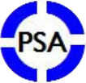

***********************
The Open-PSA Initiative
***********************

.. rubric:: The Open Initiative for Next Generation of Probabilistic Safety Assessment

As we enter a time in which safety and reliability have come to the attention of the public,
especially in the face of climate change and a nuclear renaissance,
efforts are being made in the direction of the "next generation" of Probabilistic Safety Assessment
with regards to software and methods.
These new initiatives hope to present a more informative view of the actual models
of systems, components, and their interactions,
which helps decision makers to go a step forward with their decisions.

The Open Initiative for Next Generation PSA provides
an open and transparent public forum to disseminate information,
independently review new ideas, and spread the word.
We want to emphasize openness
which leads to methods and software with better quality, better understanding, more flexibility,
encourage peer review,
and allow the transportability of models and methods.

We hope to bring to the international PSA community the benefits of an open initiative,
and to bring together the different groups who engage in large scale PSA,
in a non-competitive and commonly shared organization.

Two of our most important activities will be
as a standards body and clearing house for methodologies for the good of PSA.
In this way, researchers, practitioners, corporations, and regulators
can work together in open cooperation.

Over the last 5 years,
some non-classical calculation techniques and modeling methods in nuclear PSA
have been extensively studied.
The concern of these investigations has been to end the use of
(1) numerical approximations for which we do not know the error factors,
(2) modeling methods which leave out perhaps critical elements of the actual plant,
and (3) lack of good man-machine and organizational modeling techniques.
From all these investigations,
some alarming issues related to large, safety critical PSA models have been raised,
which we feel need to be addressed
before new calculation engines or next generation user interfaces are put into place:

- Quality assurance of calculations
- Unfounded reliance on numerical approximations and truncation
- Portability of the models between different software
- Clarity of the models
- Completeness of the models
- Modeling of human actions
- Better visualization of PSA results
- Difficulty of different software working with the same PSA model
- Lack of data and software backward and forward compatibility
- No universal format for industry data

New calculation engines and user interfaces
and a computer representation for large, safety critical PSA models,
which is independent of PSA software,
represent a step forward in addressing the above issues.

As our first activity,
we have created a working group to begin the creation of a model exchange format for PSA models.
Other working groups in the other aforementioned areas
are expected to follow the success of the first one.

We believe that each of you, who are reading this manifesto, have similar ideas.
Let us enter into an open forum together and work together
to know the limits of our methods, to push those limits, and to expand our understanding.
